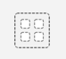
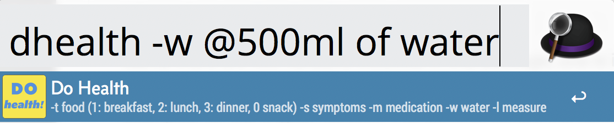
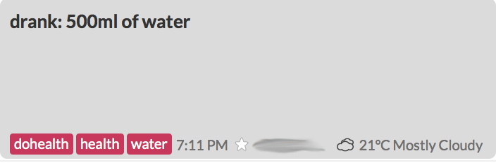

# DOHEALTH Script for Alfred.app

    

**DOHEALTH** is a script, written in **Swift**, that is used in an [Alfred][alfred] / [workflow][workflows] to write health related information to a [Day One 2][dayone] journal.

**NOTE** there are two versions included in this package, one is in **french** and the other one is in **english**. See the installtion notes to install the one you need. This ReadMe file is written with examples for the english version. The commands are the same for both versions.

- - - 

### What it does

It takes an input string as part of an Alfred action and creates an entry in a health journal in [Day One][dayone] with the content of the entry formated with a prefix depending on the type of data you're logging, i.e., `eaten:`, or `drank:` plus the input string and with optional tags.

The idea is to be able to quickly log health related information during the day with as little friction as possible. This can be used later to see patterns in your habits (eating some food is followed by these symptoms, etc.), or to report to a nutritionist or doctor. Many things can be logged automatically with IFTTT (like weight measurement taken with a smart scale, which can be directed to log into the same health journal), but some things fall outside of the automation capabilities. This is for those things you want to track.

- - -

### Caveat

This script uses something called a _Command Line Interface_ (CLI) to send entries to DayOne. It's the only method available at the moment to interact with it from another application. Because of that, when the script is run, it will launch an application called Terminal.app, which is a standard Apple application installed by default on all mac that can be found in the Utilities folder (which is itself located in the Application folder).

Launching this application is required to run the script. As a software programmer, Terminal is always open on my computer anyways (actually I use [iTerm][iterm]), so it doesn't bother me. If it does bother you, then you may want to skip this script.

Personally I think that it's much faster using this script than to launch DayOne (and possibly unlock it), and then select the right journal, click the plus button, type the text, add the tags one by one, then click the Done button.

I find that the less friction there is to keeping a health journal up to date, the better I am at it, hence this script.

- - - 

### Installation

You need a few things to make use of this script:

#### What you need

- you need the latest version of [Day One 2][dayone]
- you must have installed the Day One CLI (command line interface): select the menu `/Day One/Install Command Line Tools.../` and follow the instructions.
- you need to have [Alfred][alfred] installed, with a [PowerPack][powerpack] license (required to use [workflows][workflows])

#### Installation

- download and unzip the `dohealth` package.
- double-click the `.alfredworkflow` file to install the workflow in Alfred. Use `Health Journal.alfredworkflow` for the english version, and `Journal sante.alfredworkflow` for the french version.
- open the workflow and double-click the `external script` module.
- click the `open workflow folder in finder` button to the left of the `cancel`button. 
- copy the `DoHealthLoggerE` (english version) or `DoHealthLogger` (french version) file (a file without extension) from the `dohealth` package to the workflow folder.
- you can close the workflow folder and Alfred's preferences window.
- **make sure you have a DayOne journal with the name used in the script**, or change the script (see below) to point to an existing journal in DayOne. The name is `health` for the english version and `santé` for the french version.
- you're good to go!

#### Usage

Invoke Alfred (for me this is `⌘-space`), type `dhealth` (although I can usually just type `dh`) then `return` to select the workflow, then type the text you want to log, and press `return`.

The default entry is for something you ate and the script will create a journal entry stating that you ate, with the default tags specified in the script. So `⌘-space` `dh` `return` `a muffin and a glass of milk` `return` will create a journal entry `eaten: a muffin and a glass of milk` with tags `dohealth` and `health` for instance.

There are five types of things you can track with DoHealth:

- **food** (what you ate)
- **symptoms** (how you feel, cramps, headache, etc.)
- **medication** (what you took, including vitamines or food supplements)
- **water** (how much you drank if you want to track this — and you should!)
- **measurements** (things like _blood sugar_, _ketone levels_, _weight_, _blood pressure_, etc.)

Each of those has a specific prefix to use when invoking the script, and each one will begin the journal entry with a different prefix as well as including specific tags in addition to the default ones.

The pattern is always the same for each type:

A 'option flag' to determine which type of entry it is (in the form of an hyphen followed by a letter), followed by 0 or more optional tags, then the '@' character and the entry text.

If you want a tag with a space in it, like `food supplement` you must replace the space by an underscore, `food_supplement` when using the script. Don't worry these will be converted back to spaces by the script.

Examples:

A measurement entry: `-l ketone @0.1 mmol/l`

A medication entry: `-m morning @vitamins B complex, B2, D, C, Omega-3`

A water entry: `-w @500ml of water`

This:

Creates an entry like that:

#### Entry types syntax

##### Food

`-t optinal_tag @food eaten`

Food is the default entry type so, _if you don't need to add optional tags_, you can simply use this:

`food eaten` 

##### Symptom

`-s optinal_tag @symptom observed`

##### Medication

`-m optinal_tag @medication taken`

##### Water

`-w optinal_tag @water drank`

##### Measurement

`-l optinal_tag @measurement results`

#### Default tags

All entries will have the `dohealth` tag added by default (so you can determine if an entry was made by the script). The english version will also add a `health` tag and a french version a `santé` tag by default.s

- - - 

### Swift version

This script is made for **Swift 4.0**.

- - - 

### Modifying the script

You can modify for example the default journal to log into, the default tags, etc. by modifying the script in the included `DoHealthLogger.swift` file. You must then compile the script and make it executable and put it in the workflow folder. I use [CodeRunner][coderunner] to edit this script (and most scripts I write). It has a debugger with build-in console and creates the executable when you run the script.

- - - 

### How to contribute

I'm always happy to improve my code and learn, so if you find things to improve please submit a pull request.

#### Here are some ways you can contribute:

* by reporting bugs
* by writing or editing documentation
* by writing code ( no patch is too small : fix typos, add comments, clean up * inconsistent whitespace )
* by refactoring code
* by closing issues
* by reviewing patches
* Submitting an Issue

I use the GitHub issue tracker to track bugs and features. Before submitting a bug report or feature request, check to make sure it hasn't already been submitted.

#### Submitting a Pull Request

1. Fork the repository.
1. Create a topic branch.
1. Implement your feature or bug fix.
1. Add, commit, and push your changes.
1. Submit a pull request.

This is based on [https://github.com/middleman/middleman-heroku/blob/master/CONTRIBUTING.md](https://github.com/middleman/middleman-heroku/blob/master/CONTRIBUTING.md)

- - - 

### License

DoHealth is Copyright © 2018 Denis Ricard. It is free software, and may be redistributed under the terms specified in the LICENSE file.

- - - 

### About

I'm an iOS developer. You can find my web site at [hexaedre.com](http://hexaedre.com), find me on Twitter under [@hexaedre](http://twitter.com/hexaedre), or [contact me](http://hexaedre.com/contact/).

[iterm]: https://iterm2.com
[dayone]: http://dayoneapp.com
[alfred]: https://www.alfredapp.com
[workflows]: https://www.alfredapp.com/workflows/
[powerpack]: https://www.alfredapp.com/powerpack/
[coderunner]: https://coderunnerapp.com